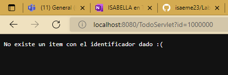
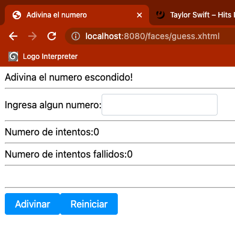

# Laboratorio 5
## CVDS 2022 - 2
### INTEGRANTES: SANTIAGO OSPINA, ISABELLA MANRIQUE
### PARTE I. - JUGANDO A SER UN CLIENTE HTTP

1. Abra una terminal Linux o consola de comandos Windows.

2. Realice una conexión síncrona TCP/IP a través de Telnet al siguiente servidor:
   * Host: www.escuelaing.edu.co
   * Puerto: 80
   

3. Antes de que el servidor cierre la conexión por falta de comunicación:
    * Solicite al servidor el recurso ‘sssss/abc.html’,
      usando la versión 1.0 de HTTP.
   
    * ¿Qué código de error sale? 400 Bad Request
    * ¿Qué otros códigos de error existen?, ¿En qué caso se manejarán?
      
       **Códigos de Información:** 1xx. Alertan al cliente que espere por
       una respuesta final.
   
       **Códigos de éxito:** 2xx. Informa que la acción tomada por el
       cliente fue recibida, entendida y aceptada.
   
       **Códigos de redirección:** 3xx. En este tipo de casos se indica que
       cliente debe tomar acciones adicionales para completar la petición.
       
       **Códigos de error de cliente:** 4xx. El error parece ser causado
        por el cliente.

       **Códigos de error del servidor:** 5xx. El servidor falla en completar la petición.

4. Realice una nueva conexión con telnet, esta vez a:
   * Host: www.httpbin.org
   * Puerto: 80
   * Versión HTTP: 1.1

   Ahora, solicite (GET) el recurso /html. ¿Qué se obtiene como resultado?
   
   

5. Seleccione el contenido HTML de la respuesta y copielo al cortapapeles CTRL-SHIFT-C. Ejecute el comando wc (word count) para contar palabras con la
   opción -c para contar el número de caracteres:

   Guardamos el contenido del resultado en un archivo de texto y ejecutamos el comando
    

6. En la práctica no se utiliza telnet para hacer peticiones a sitios web sino el comando curl con ayuda de la línea de comandos:
   

   Utilice ahora el parámetro -v y con el parámetro -i:
    
   **Usando el parametro -v**

   Nos muestra de forma actualizada las consultas y pedidos que se hacen para obtener la informacion:
   
  
   Nos muestra mas informacion detallada de la fecha e informacion sobre el contenido requerido
   
   
7. Abra un navegador, y en la barra de direcciones ponga la URL con la cual se le enviarán peticiones al ‘SampleServlet’. Tenga en cuenta que la URL tendrá
   como host ‘localhost’, como puerto, el configurado en el pom.xml y el path debe ser el del Servlet. Debería obtener un mensaje de saludo.

   

8. Observe que el Servlet ‘SampleServlet’ acepta peticiones GET, y opcionalmente, lee el parámetro ‘name’. Ingrese la misma URL, pero ahora agregando
    un parámetro GET (si no sabe como hacerlo, revise la documentación en http://www.w3schools.com/tags/ref_httpmethods.asp)

   

9. Busque el artefacto gson en el repositorio de maven y agregue la dependencia.

 
 
10. En el navegador revise la dirección https://jsonplaceholder.typicode.com/todos/1. Intente cambiando diferentes números al final del path de la url.

**Original:**

 
 
**Numero 2:**

**Numero 3:**

**Numero 4:**

11. Basado en la respuesta que le da el servicio del punto anterior, cree la clase edu.eci.cvds.servlet.model.Todo con un constructor vacío y los
métodos getter y setter para las propiedades de los "To Dos" que se encuentran en la url indicada.

12. Utilice la siguiente clase para consumir el servicio que se encuentra en la dirección url del punto anterior.
13. Implementacion del metodo con errores:

## Parte III
14. En la página anterior, cree un formulario que tenga un campo para ingresar un número (si no ha manejado html antes, revisehttp://www.w3schools.com/html/ ) y un botón. El formulario debe usar como método ‘POST’, y como acción, la ruta relativa del último servlet creado(es decir la URL pero excluyendo ‘http://localhost:8080/’).**

15. Revise este ejemplo de validación de formularios con javascript y agruéguelo a su formulario, de manera que -al momento de hacer ‘submit’- desde elbrowser se valide que el valor ingresado es un valor numérico.

16. Recompile y ejecute la aplicación. Abra en su navegador en la página del formulario, y rectifique que la página hecha anteriormente sea mostrada.Ingrese los datos y verifique los resultados. Cambie el formulario para que ahora en lugar de POST, use el método GET . Qué diferencia observa?

Cuando se usa el metodo post, se oculta en la url el id que se esta utilizando mientras que con get la url nos muestra el id ingresado en el formulario.

## Parte IV
1. Realizar un Backing Bean con las especificaciones pedidas en el labratorio, con su respectivo form. Además, crear un archivo guess.xhtml que mostrara el formato para adivinar un numero ademas de dos botones que nos ayudaran a jugar:

2. Abrimos el navegador para tratar de adivinar el número, con el servicio iniciado el programa se ve de la siguiente forma:

3. Abrimos otro navegador y realizamos 5 intentos en uno y un intento en el otro:
En este primer navegador, hacemos 5 intentos:

Al hacer solo uno en un navegador diferente, vemos como se acumularon los intentos del primer navegador y se pasaron a este:

4. Abortamos el proceso de Tomcat y modificamos el codigo del Backing Bean para cambiar @SessionScoped en lugar de @ApplicationScoped.

Reiniciamos la aplicacion y ahora realizamos el mismo ejercicio:
Con un solo intento podemos ver que ahora cada navegador es independiente del otro

5. Abrimos opciones del desarrollador y buscaremos:
   * Codigo HTML generado
   
6. Agregamos la funcionalidad de mostrar los intentos fallidos al usuario:
